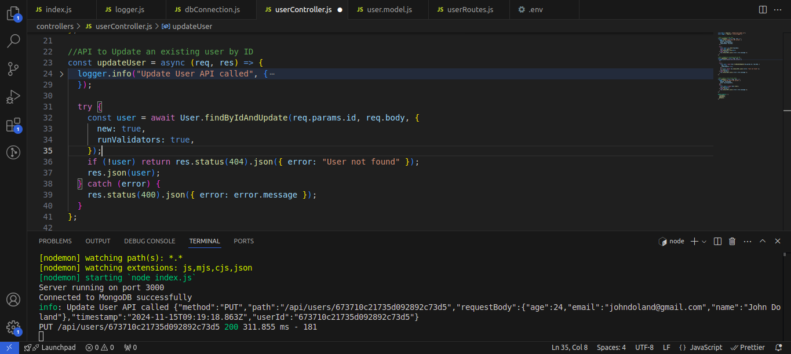

# Screenshots of the logs and Postman response.

**1) This screenshots describes the log for the POST Request.**

**This screenshots describes the Postman response for the POST Request.**

**2) This screenshots describes the log for the PUT Request.**

**This screenshots describes the Postman response for the PUT Request.**

**3) This screenshots describes the log for the GET Request.**

**This screenshots describes the Postman response for the GET Request.**

